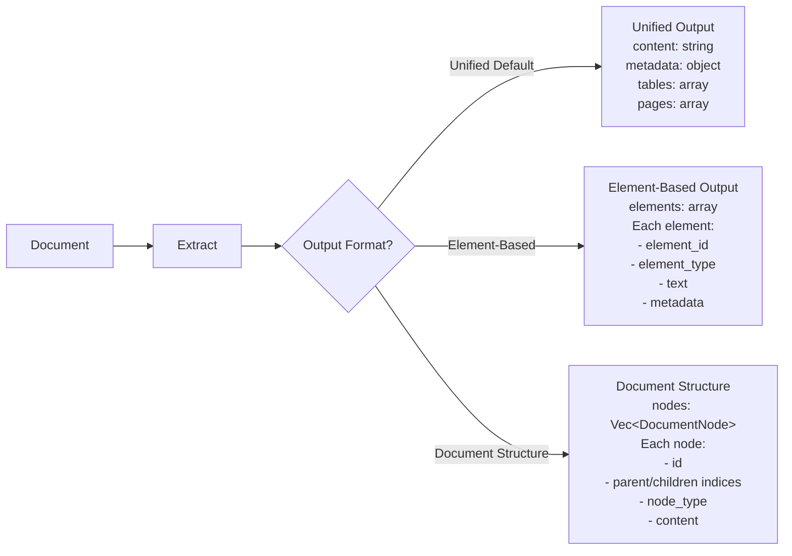

# Document Structure

## Overview

Kreuzberg supports **document structure output**, an advanced output format that provides a hierarchical, tree-based representation of document content. Unlike element-based output which returns a flat array of semantic elements, document structure uses a node-based tree representation where each node maintains explicit parent-child relationships through index-based references.

### When to Use Document Structure

**Use document structure** when you need:

- Hierarchical document representation with explicit parent-child relationships
- Natural section and subsection nesting (chapters → sections → subsections)
- Structured table grids with cell coordinates and spanning
- Inline text annotations (bold, italic, links) within paragraph content
- Content layer classification (body, header, footer, footnote)
- Page range information for multi-page nodes
- Deterministic node IDs for node tracking and deduplication
- Tree traversal with index-based navigation

**Use element-based output** when you need:

- Flat array of semantic elements without hierarchy
- Compatibility with Unstructured.io workflows
- Simpler iteration and filtering patterns
- Element-level metadata (bounding boxes, coordinates)

**Use unified output (default)** when you need:

- Complete document text in a single field
- Simpler processing workflows
- Maximum extraction performance
- Rich document-level metadata

## Comparison: Unified vs Element-Based vs Document Structure

The following diagram shows the three output paths:



### Feature Comparison Table

| Aspect               | Unified                       | Element-Based                 | Document Structure                             |
| -------------------- | ----------------------------- | ----------------------------- | ---------------------------------------------- |
| **Output Structure** | Single `content` field        | Array of elements             | Flat `Vec<DocumentNode>` with index references |
| **Hierarchy**        | None                          | Inferred from levels          | Explicit parent/child indices                  |
| **Traversal**        | Sequential iteration          | Flat array filtering          | Tree walking (parent → children)               |
| **Nesting**          | Not supported                 | No parent-child links         | Full parent-child relationships                |
| **Annotations**      | No inline support             | No inline support             | TextAnnotation per node (bold, italic, links)  |
| **Tables**           | `result.tables` array         | Table elements                | TableGrid with cell structure                  |
| **Content Layers**   | Not classified                | Not classified                | ContentLayer (body, header, footer, footnote)  |
| **Node IDs**         | Not provided                  | `element_id`                  | Deterministic `NodeId`                         |
| **Page Ranges**      | `page` per element            | `page_number`                 | `page` and `page_end`                          |
| **Bounding Boxes**   | Per-element `coordinates`     | Per-element `coordinates`     | Per-node `bbox`                                |
| **Best For**         | LLM prompts, full-text search | RAG chunking, semantic search | Hierarchical document apps, knowledge graphs   |

## Enabling Document Structure

To enable document structure output, set `include_document_structure: true` in your extraction configuration.

=== "Python"

    ```python
    from kreuzberg import extract_file_sync, ExtractionConfig

    # Document structure configuration
    config = ExtractionConfig(
        include_document_structure=True
    )

    result = extract_file_sync("document.pdf", config=config)

    # Access document structure
    if result.document:
        print(f"Total nodes: {len(result.document.nodes)}")
        for node in result.document.nodes:
            print(f"  [{node.id}] {node.content['node_type']}: {node.content.get('text', '')[:30]}")
    ```

=== "TypeScript"

    ```typescript
    import { extractFileSync, ExtractionConfig } from '@kreuzberg/node';

    // Document structure configuration
    const config: ExtractionConfig = {
      includeDocumentStructure: true
    };

    const result = extractFileSync("document.pdf", null, config);

    // Access document structure
    if (result.document) {
      console.log(`Total nodes: ${result.document.nodes.length}`);
      for (const node of result.document.nodes) {
        const text = node.content.text || '';
        console.log(`  [${node.id}] ${node.content.nodeType}: ${text.slice(0, 30)}`);
      }
    }
    ```

=== "Rust"

    ```rust
    use kreuzberg::{extract_file_sync, ExtractionConfig};

    // Document structure configuration
    let config = ExtractionConfig {
        include_document_structure: true,
        ..Default::default()
    };

    let result = extract_file_sync("document.pdf", None, &config)?;

    // Access document structure
    if let Some(doc_struct) = result.document {
        println!("Total nodes: {}", doc_struct.nodes.len());
        for node in &doc_struct.nodes {
            let text = match &node.content {
                DocumentNode::Paragraph { text } => text,
                DocumentNode::Heading { text, .. } => text,
                DocumentNode::Title { text } => text,
                _ => ""
            };
            println!("  [{}] {}: {}...", node.id, node.content.node_type(), &text[..30.min(text.len())]);
        }
    }
    ```

=== "Ruby"

    ```ruby
    require 'kreuzberg'

    # Document structure configuration
    config = Kreuzberg::Config::Extraction.new(include_document_structure: true)

    result = Kreuzberg.extract_file_sync('document.pdf', config: config)

    # Access document structure
    if result.document
      puts "Total nodes: #{result.document.nodes.length}"
      result.document.nodes.each do |node|
        text = node.content['text'] || ''
        puts "  [#{node.id}] #{node.content['node_type']}: #{text[0...30]}"
      end
    end
    ```

=== "PHP"

    ```php
    <?php
    use Kreuzberg\ExtractionConfig;
    use Kreuzberg\Kreuzberg;

    // Document structure configuration
    $config = new ExtractionConfig();
    $config->setIncludeDocumentStructure(true);

    $result = Kreuzberg::extractFileSync('document.pdf', $config);

    // Access document structure
    if ($result->getDocument()) {
        $doc = $result->getDocument();
        echo "Total nodes: " . count($doc->getNodes()) . "\n";
        foreach ($doc->getNodes() as $node) {
            $text = $node->getContent()['text'] ?? '';
            $nodeType = $node->getContent()['node_type'];
            echo "[{$node->getId()}] $nodeType: " . substr($text, 0, 30) . "\n";
        }
    }
    ?>
    ```

=== "Go"

    ```go
    package main

    import (
        "fmt"
        "kreuzberg"
    )

    func main() {
        // Document structure configuration
        config := &kreuzberg.ExtractionConfig{
            IncludeDocumentStructure: true,
        }

        result, err := kreuzberg.ExtractFileSync("document.pdf", config)
        if err != nil {
            panic(err)
        }

        // Access document structure
        if result.Document != nil {
            fmt.Printf("Total nodes: %d\n", len(result.Document.Nodes))
            for _, node := range result.Document.Nodes {
                nodeType := node.Content["node_type"]
                text := node.Content["text"]
                if len(text) > 30 {
                    text = text[:30]
                }
                fmt.Printf("  [%s] %s: %s\n", node.ID, nodeType, text)
            }
        }
    }
    ```

=== "Java"

    ```java
    import io.kreuzberg.Kreuzberg;
    import io.kreuzberg.ExtractionConfig;
    import io.kreuzberg.ExtractionResult;
    import io.kreuzberg.DocumentStructure;
    import io.kreuzberg.DocumentNode;

    // Document structure configuration
    ExtractionConfig config = new ExtractionConfig();
    config.setIncludeDocumentStructure(true);

    ExtractionResult result = Kreuzberg.extractFileSync("document.pdf", config);

    // Access document structure
    if (result.getDocument() != null) {
        DocumentStructure docStruct = result.getDocument();
        System.out.println("Total nodes: " + docStruct.getNodes().size());
        for (DocumentNode node : docStruct.getNodes()) {
            String nodeType = (String) node.getContent().get("node_type");
            String text = (String) node.getContent().get("text");
            if (text != null && text.length() > 30) {
                text = text.substring(0, 30);
            }
            System.out.println("[" + node.getId() + "] " + nodeType + ": " + text);
        }
    }
    ```

=== "C#"

    ```csharp
    using Kreuzberg;

    // Document structure configuration
    var config = new ExtractionConfig
    {
        IncludeDocumentStructure = true
    };

    var result = Kreuzberg.ExtractFileSync("document.pdf", config);

    // Access document structure
    if (result.Document != null)
    {
        Console.WriteLine($"Total nodes: {result.Document.Nodes.Count}");
        foreach (var node in result.Document.Nodes)
        {
            var nodeType = node.Content["node_type"];
            var text = node.Content.ContainsKey("text") ? node.Content["text"] : "";
            if (text.Length > 30)
                text = text.Substring(0, 30);
            Console.WriteLine($"[{node.Id}] {nodeType}: {text}");
        }
    }
    ```

=== "Elixir"

    ```elixir
    # Document structure configuration
    config = %Kreuzberg.ExtractionConfig{
      include_document_structure: true
    }

    {:ok, result} = Kreuzberg.extract_file_sync("document.pdf", config)

    # Access document structure
    if result.document do
      IO.puts("Total nodes: #{length(result.document.nodes)}")
      Enum.each(result.document.nodes, fn node ->
        text = Map.get(node.content, "text", "")
        node_type = Map.get(node.content, "node_type")
        text_preview = String.slice(text, 0, 30)
        IO.puts("[#{node.id}] #{node_type}: #{text_preview}")
      end)
    end
    ```

=== "WASM"

    ```typescript
    import { extractFileSync, ExtractionConfig } from 'kreuzberg-wasm';

    // Document structure configuration
    const config: ExtractionConfig = {
      includeDocumentStructure: true
    };

    const result = extractFileSync(fileBuffer, "application/pdf", config);

    // Access document structure
    if (result.document) {
      console.log(`Total nodes: ${result.document.nodes.length}`);
      for (const node of result.document.nodes) {
        const text = node.content.text || '';
        console.log(`  [${node.id}] ${node.content.nodeType}: ${text.slice(0, 30)}`);
      }
    }
    ```

## Node Types Reference

Document structure supports 13 distinct node types, each with specific content fields and use cases.

### Title

The main document title.

**Content fields**:

- `text: String` — Title text

**Metadata**:

- `node_type: "title"`
- `content_layer: ContentLayer` — Usually Body
- `page: Option<u32>` — Page where title appears

**Example JSON**:

```json
{
  "id": "node-a3f2b1c4",
  "node_type": "title",
  "content": {
    "node_type": "title",
    "text": "Machine Learning Fundamentals"
  },
  "parent": null,
  "children": [1, 2, 3],
  "content_layer": "body",
  "page": 1,
  "page_end": null,
  "bbox": {
    "x0": 72.0,
    "y0": 700.0,
    "x1": 540.0,
    "y1": 730.0
  },
  "annotations": []
}
```

### Heading

Section and subsection headings with hierarchy levels.

**Content fields**:

- `level: u8` — Heading level (1-6)
- `text: String` — Heading text

**Metadata**:

- `node_type: "heading"`
- `parent: Option<NodeIndex>` — Parent section or title
- `children: Vec<NodeIndex>` — Child nodes (paragraphs, subheadings, etc.)

**Example JSON**:

```json
{
  "id": "node-f2c9d3e8",
  "node_type": "heading",
  "content": {
    "node_type": "heading",
    "level": 2,
    "text": "Supervised Learning"
  },
  "parent": 0,
  "children": [4, 5, 6],
  "content_layer": "body",
  "page": 5,
  "bbox": {
    "x0": 72.0,
    "y0": 600.0,
    "x1": 400.0,
    "y1": 620.0
  },
  "annotations": []
}
```

### Paragraph

Body paragraphs and narrative text.

**Content fields**:

- `text: String` — Paragraph text

**Metadata**:

- `node_type: "paragraph"`
- `annotations: Vec<TextAnnotation>` — Inline formatting (bold, italic, links)

**Example JSON**:

```json
{
  "id": "node-d4b7f3a9",
  "node_type": "paragraph",
  "content": {
    "node_type": "paragraph",
    "text": "Machine learning enables systems to learn from data without being explicitly programmed."
  },
  "parent": 1,
  "children": [],
  "content_layer": "body",
  "page": 5,
  "annotations": [
    {
      "start": 0,
      "end": 16,
      "kind": {
        "annotation_type": "bold"
      }
    }
  ]
}
```

### List

Container node for list items (bullet, numbered, lettered, indented).

**Content fields**:

- `ordered: bool` — Whether list is ordered (numbered/lettered) or unordered (bullet)

**Metadata**:

- `node_type: "list"`
- `children: Vec<NodeIndex>` — Child list_item nodes

**Example JSON**:

```json
{
  "id": "node-e5a9c3b7",
  "node_type": "list",
  "content": {
    "node_type": "list",
    "ordered": false
  },
  "parent": 1,
  "children": [10, 11, 12],
  "content_layer": "body",
  "page": 6
}
```

### List Item

Individual list item within a list container.

**Content fields**:

- `text: String` — List item text

**Metadata**:

- `node_type: "list_item"`
- `parent: Option<NodeIndex>` — Parent list node

**Example JSON**:

```json
{
  "id": "node-c2f8d1a6",
  "node_type": "list_item",
  "content": {
    "node_type": "list_item",
    "text": "Supervised learning uses labeled training data"
  },
  "parent": 9,
  "children": [],
  "content_layer": "body",
  "page": 6,
  "annotations": []
}
```

### Table

Structured tabular data with cell-level information.

**Content fields**:

- `grid: TableGrid` — Grid structure with rows, columns, and cells

**Metadata**:

- `node_type: "table"`
- `page` and `page_end` — Page range for multi-page tables

**Example JSON**:

```json
{
  "id": "node-b1f4a8c2",
  "node_type": "table",
  "content": {
    "node_type": "table",
    "grid": {
      "rows": 3,
      "cols": 3,
      "cells": [
        {
          "content": "Algorithm",
          "row": 0,
          "col": 0,
          "row_span": 1,
          "col_span": 1,
          "is_header": true,
          "bbox": null
        },
        {
          "content": "Decision Tree",
          "row": 1,
          "col": 0,
          "row_span": 1,
          "col_span": 1,
          "is_header": false
        }
      ]
    }
  },
  "parent": 1,
  "children": [],
  "content_layer": "body",
  "page": 7,
  "bbox": {
    "x0": 72.0,
    "y0": 400.0,
    "x1": 540.0,
    "y1": 500.0
  }
}
```

### Image

Embedded images and visual content.

**Content fields**:

- `description: Option<String>` — Alt text or image description
- `image_index: Option<u32>` — Reference to image in extraction result

**Metadata**:

- `node_type: "image"`
- `page: Option<u32>` — Page containing image

**Example JSON**:

```json
{
  "id": "node-a7d2f1c9",
  "node_type": "image",
  "content": {
    "node_type": "image",
    "description": "Neural network architecture diagram",
    "image_index": 2
  },
  "parent": 1,
  "children": [],
  "content_layer": "body",
  "page": 8,
  "bbox": {
    "x0": 100.0,
    "y0": 200.0,
    "x1": 500.0,
    "y1": 450.0
  }
}
```

### Code

Code blocks with optional language specification.

**Content fields**:

- `text: String` — Code block text
- `language: Option<String>` — Programming language (e.g., "python", "rust", "javascript")

**Metadata**:

- `node_type: "code"`
- `content_layer: ContentLayer` — Usually Body

**Example JSON**:

```json
{
  "id": "node-c9f3a2e7",
  "node_type": "code",
  "content": {
    "node_type": "code",
    "text": "def train_model(data, labels):\n    model = LinearRegression()\n    model.fit(data, labels)\n    return model",
    "language": "python"
  },
  "parent": 1,
  "children": [],
  "content_layer": "body",
  "page": 9,
  "annotations": []
}
```

### Quote

Quoted text blocks with optional attribution.

**Content fields**: None (container node)

**Metadata**:

- `node_type: "quote"`
- `children: Vec<NodeIndex>` — Child nodes (typically paragraphs)

**Example JSON**:

```json
{
  "id": "node-d1b8f4c3",
  "node_type": "quote",
  "content": {
    "node_type": "quote"
  },
  "parent": 1,
  "children": [20],
  "content_layer": "body",
  "page": 10
}
```

### Formula

Mathematical formulas and equations.

**Content fields**:

- `text: String` — Formula text (plain text, LaTeX, or MathML)

**Metadata**:

- `node_type: "formula"`
- `page: Option<u32>` — Page containing formula

**Example JSON**:

```json
{
  "id": "node-e3c7a9f2",
  "node_type": "formula",
  "content": {
    "node_type": "formula",
    "text": "y = mx + b"
  },
  "parent": 1,
  "children": [],
  "content_layer": "body",
  "page": 11,
  "bbox": {
    "x0": 200.0,
    "y0": 300.0,
    "x1": 350.0,
    "y1": 320.0
  }
}
```

### Footnote

Footnote and endnote content.

**Content fields**:

- `text: String` — Footnote text

**Metadata**:

- `node_type: "footnote"`
- `content_layer: ContentLayer` — Usually Footnote

**Example JSON**:

```json
{
  "id": "node-f8a1b2c3",
  "node_type": "footnote",
  "content": {
    "node_type": "footnote",
    "text": "See Box et al. (1964) for theoretical foundations."
  },
  "parent": null,
  "children": [],
  "content_layer": "footnote",
  "page": 12
}
```

### Group

Semantic grouping container for sections with optional heading.

**Content fields**:

- `label: Option<String>` — Section label or identifier
- `heading_level: Option<u8>` — Heading level if group has a title
- `heading_text: Option<String>` — Heading text for the group

**Metadata**:

- `node_type: "group"`
- `children: Vec<NodeIndex>` — Child nodes in section

**Example JSON**:

```json
{
  "id": "node-g1h2i3j4",
  "node_type": "group",
  "content": {
    "node_type": "group",
    "label": "chapter_2",
    "heading_level": 1,
    "heading_text": "Advanced Topics"
  },
  "parent": 0,
  "children": [3, 4, 5, 6],
  "content_layer": "body",
  "page": 15
}
```

### Page Break

Page boundary marker in multi-page documents.

**Content fields**: None (marker node)

**Metadata**:

- `node_type: "page_break"`
- `page: Option<u32>` — Starting page number
- `page_end: Option<u32>` — Ending page number (if transitioning)

**Example JSON**:

```json
{
  "id": "node-pb-0001",
  "node_type": "page_break",
  "content": {
    "node_type": "page_break"
  },
  "parent": null,
  "children": [],
  "content_layer": "body",
  "page": 1,
  "page_end": 2
}
```

## Content Layers

Content layers classify nodes by their position and role in the document layout:

| Layer        | Description            | Typical Nodes                               | Example                  |
| ------------ | ---------------------- | ------------------------------------------- | ------------------------ | -------- |
| **body**     | Main document content  | Headings, paragraphs, lists, tables, images | Chapter text, sections   |
| **header**   | Page header content    | Title text, repeated headers                | "Chapter 5: Advanced ML" |
| **footer**   | Page footer content    | Page numbers, copyright                     | "© 2025                  | Page 42" |
| **footnote** | Footnotes and endnotes | Footnote text, references                   | "1. See Smith (2020)"    |

Access content layer:

=== "Python"

    ```python
    for node in result.document.nodes:
        layer = node.content_layer
        if layer == "body":
            process_main_content(node)
        elif layer == "header":
            track_header(node)
        elif layer == "footer":
            track_footer(node)
        elif layer == "footnote":
            process_footnote(node)
    ```

=== "Rust"

    ```rust
    for node in &doc_struct.nodes {
        match node.content_layer {
            ContentLayer::Body => process_main_content(&node),
            ContentLayer::Header => track_header(&node),
            ContentLayer::Footer => track_footer(&node),
            ContentLayer::Footnote => process_footnote(&node),
        }
    }
    ```

## Text Annotations

Paragraphs and other text nodes can include inline annotations for formatting and links.

### AnnotationKind Types

| Kind              | Fields                                 | Example                                                           |
| ----------------- | -------------------------------------- | ----------------------------------------------------------------- |
| **bold**          | None                                   | `{"start": 0, "end": 5, "kind": {"annotation_type": "bold"}}`     |
| **italic**        | None                                   | `{"start": 10, "end": 20, "kind": {"annotation_type": "italic"}}` |
| **underline**     | None                                   | Underlined text                                                   |
| **strikethrough** | None                                   | ~~Deleted~~ text                                                  |
| **code**          | None                                   | `inline_code`                                                     |
| **subscript**     | None                                   | H₂O                                                               |
| **superscript**   | None                                   | E=mc²                                                             |
| **link**          | `url: String`, `title: Option<String>` | Links with optional titles                                        |

### Working with Annotations

=== "Python"

    ```python
    for node in result.document.nodes:
        if node.node_type == "paragraph":
            text = node.content['text']
            for annotation in node.annotations:
                start, end = annotation['start'], annotation['end']
                annotated_text = text[start:end]
                kind = annotation['kind']['annotation_type']

                if kind == "link":
                    url = annotation['kind'].get('url')
                    print(f"Link: {annotated_text} -> {url}")
                else:
                    print(f"{kind.upper()}: {annotated_text}")
    ```

=== "TypeScript"

    ```typescript
    for (const node of result.document!.nodes) {
      if (node.content.nodeType === 'paragraph') {
        const text = node.content.text!;
        for (const annotation of node.annotations) {
          const annotatedText = text.slice(annotation.start, annotation.end);
          const kind = annotation.kind.annotationType;

          if (kind === 'link') {
            const url = annotation.kind.url;
            console.log(`Link: ${annotatedText} -> ${url}`);
          } else {
            console.log(`${kind.toUpperCase()}: ${annotatedText}`);
          }
        }
      }
    }
    ```

=== "Rust"

    ```rust
    for node in &doc_struct.nodes {
        if let DocumentContent::Paragraph { text, .. } = &node.content {
            for annotation in &node.annotations {
                let annotated_text = &text[annotation.start as usize..annotation.end as usize];
                match &annotation.kind {
                    AnnotationKind::Bold => println!("BOLD: {}", annotated_text),
                    AnnotationKind::Italic => println!("ITALIC: {}", annotated_text),
                    AnnotationKind::Link { url, title } => {
                        println!("LINK: {} -> {}", annotated_text, url);
                    }
                    _ => {}
                }
            }
        }
    }
    ```

## Table Grid

Tables are structured using a grid representation with explicit cell data.

### TableGrid Structure

```json
{
  "rows": 3,
  "cols": 3,
  "cells": [
    {
      "content": "Algorithm",
      "row": 0,
      "col": 0,
      "row_span": 1,
      "col_span": 1,
      "is_header": true,
      "bbox": {
        "x0": 72.0,
        "y0": 500.0,
        "x1": 200.0,
        "y1": 530.0
      }
    },
    {
      "content": "Type",
      "row": 0,
      "col": 1,
      "row_span": 1,
      "col_span": 1,
      "is_header": true
    },
    {
      "content": "Accuracy",
      "row": 0,
      "col": 2,
      "row_span": 1,
      "col_span": 1,
      "is_header": true
    },
    {
      "content": "Decision Tree",
      "row": 1,
      "col": 0,
      "row_span": 1,
      "col_span": 1,
      "is_header": false
    }
  ]
}
```

### Accessing Table Data

=== "Python"

    ```python
    for node in result.document.nodes:
        if node.node_type == "table":
            grid = node.content['grid']
            rows, cols = grid['rows'], grid['cols']
            print(f"Table: {rows}x{cols}")

            # Build 2D grid for easier access
            table_data = [[None] * cols for _ in range(rows)]
            for cell in grid['cells']:
                table_data[cell['row']][cell['col']] = cell['content']

            # Print table
            for row in table_data:
                print(" | ".join(str(cell or "") for cell in row))
    ```

=== "TypeScript"

    ```typescript
    for (const node of result.document!.nodes) {
      if (node.content.nodeType === 'table') {
        const grid = node.content.grid!;
        console.log(`Table: ${grid.rows}x${grid.cols}`);

        // Build 2D grid for easier access
        const tableData: (string | null)[][] = Array(grid.rows)
          .fill(null)
          .map(() => Array(grid.cols).fill(null));

        for (const cell of grid.cells) {
          tableData[cell.row][cell.col] = cell.content;
        }

        // Print table
        for (const row of tableData) {
          console.log(row.map(c => c || "").join(" | "));
        }
      }
    }
    ```

=== "Python with Pandas"

    ```python
    import pandas as pd

    for node in result.document.nodes:
        if node.node_type == "table":
            grid = node.content['grid']

            # Convert to DataFrame
            data = {}
            for cell in grid['cells']:
                if cell['is_header'] and cell['row'] == 0:
                    col_key = f"col_{cell['col']}"
                    data.setdefault(col_key, [])

            # Simpler: build list of dicts
            rows = []
            for r in range(grid['rows']):
                row_data = {}
                for cell in grid['cells']:
                    if cell['row'] == r:
                        row_data[f"col_{cell['col']}"] = cell['content']
                if row_data:
                    rows.append(row_data)

            df = pd.DataFrame(rows)
            print(df)
    ```

## Traversal Examples

Document structure enables tree-based traversal for hierarchical navigation.

### Walking the Tree (Depth-First)

=== "Python"

    ```python
    def traverse_tree(node_idx, nodes, indent=0):
        """Recursively traverse document tree depth-first."""
        node = nodes[node_idx]
        prefix = "  " * indent
        node_type = node.content['node_type']
        text = node.content.get('text', '')[:30]
        print(f"{prefix}{node_type}: {text}")

        # Visit children
        for child_idx in node.children:
            traverse_tree(child_idx, nodes, indent + 1)

    # Start from root nodes (those with no parent)
    root_nodes = [i for i, n in enumerate(result.document.nodes) if n.parent is None]
    for root_idx in root_nodes:
        traverse_tree(root_idx, result.document.nodes)
    ```

=== "TypeScript"

    ```typescript
    function traverseTree(nodeIdx: number, nodes: DocumentNode[], indent = 0): void {
      const node = nodes[nodeIdx];
      const prefix = "  ".repeat(indent);
      const nodeType = node.content.nodeType;
      const text = (node.content.text || "").slice(0, 30);
      console.log(`${prefix}${nodeType}: ${text}`);

      // Visit children
      for (const childIdx of node.children) {
        traverseTree(childIdx, nodes, indent + 1);
      }
    }

    // Start from root nodes
    const rootNodes = result.document!.nodes
      .map((n, i) => (n.parent === null ? i : -1))
      .filter(i => i >= 0);

    for (const rootIdx of rootNodes) {
      traverseTree(rootIdx, result.document!.nodes);
    }
    ```

### Finding All Sections

=== "Python"

    ```python
    def find_sections(nodes, max_level=2):
        """Find all section headings up to max level."""
        sections = []
        for i, node in enumerate(nodes):
            if node.node_type == "heading":
                level = node.content['level']
                if level <= max_level:
                    sections.append({
                        'index': i,
                        'level': level,
                        'text': node.content['text'],
                        'page': node.page,
                        'children': node.children
                    })
        return sections

    sections = find_sections(result.document.nodes, max_level=2)
    for section in sections:
        indent = "  " * (section['level'] - 1)
        print(f"{indent}{section['text']} (p. {section['page']})")
    ```

### Building a Table of Contents

=== "Python"

    ```python
    def build_toc(nodes):
        """Build table of contents from headings."""
        toc = []
        for i, node in enumerate(nodes):
            if node.node_type in ["title", "heading"]:
                if node.node_type == "title":
                    level = 0
                    text = node.content['text']
                else:
                    level = node.content['level']
                    text = node.content['text']

                toc.append({
                    'level': level,
                    'text': text,
                    'page': node.page,
                    'node_idx': i
                })
        return toc

    toc = build_toc(result.document.nodes)
    for entry in toc:
        indent = "    " * entry['level']
        page = entry['page'] or "?"
        print(f"{indent}{entry['text']} (p. {page})")
    ```

### Extracting Section Content

=== "Python"

    ```python
    def extract_section_content(nodes, section_idx):
        """Extract all content under a section heading."""
        content = []
        section = nodes[section_idx]

        # Collect all descendants
        def collect_descendants(node_idx, results):
            node = nodes[node_idx]
            if node.node_type == "paragraph":
                results.append(node.content['text'])
            elif node.node_type == "list_item":
                results.append(f"• {node.content['text']}")

            for child_idx in node.children:
                collect_descendants(child_idx, results)

        for child_idx in section.children:
            collect_descendants(child_idx, content)

        return "\n".join(content)

    # Extract content under section at index 5
    section_text = extract_section_content(result.document.nodes, 5)
    print(section_text)
    ```

## JSON Output Example

Here is a complete example showing a small document as DocumentStructure JSON:

```json
{
  "nodes": [
    {
      "id": "node-title-001",
      "content": {
        "node_type": "title",
        "text": "Introduction to Machine Learning"
      },
      "parent": null,
      "children": [1, 3],
      "content_layer": "body",
      "page": 1,
      "page_end": null,
      "bbox": {
        "x0": 72.0,
        "y0": 700.0,
        "x1": 540.0,
        "y1": 730.0
      },
      "annotations": []
    },
    {
      "id": "node-heading-001",
      "content": {
        "node_type": "heading",
        "level": 2,
        "text": "What is Machine Learning?"
      },
      "parent": 0,
      "children": [2],
      "content_layer": "body",
      "page": 1,
      "bbox": {
        "x0": 72.0,
        "y0": 650.0,
        "x1": 400.0,
        "y1": 670.0
      },
      "annotations": []
    },
    {
      "id": "node-para-001",
      "content": {
        "node_type": "paragraph",
        "text": "Machine learning is a subset of artificial intelligence that enables systems to learn from data."
      },
      "parent": 1,
      "children": [],
      "content_layer": "body",
      "page": 1,
      "annotations": [
        {
          "start": 0,
          "end": 16,
          "kind": {
            "annotation_type": "bold"
          }
        },
        {
          "start": 75,
          "end": 95,
          "kind": {
            "annotation_type": "italic"
          }
        }
      ]
    },
    {
      "id": "node-heading-002",
      "content": {
        "node_type": "heading",
        "level": 2,
        "text": "Types of Learning"
      },
      "parent": 0,
      "children": [4],
      "content_layer": "body",
      "page": 2,
      "annotations": []
    },
    {
      "id": "node-list-001",
      "content": {
        "node_type": "list",
        "ordered": false
      },
      "parent": 3,
      "children": [5, 6, 7],
      "content_layer": "body",
      "page": 2,
      "annotations": []
    },
    {
      "id": "node-list-item-001",
      "content": {
        "node_type": "list_item",
        "text": "Supervised Learning: Learning from labeled data"
      },
      "parent": 4,
      "children": [],
      "content_layer": "body",
      "page": 2,
      "annotations": []
    },
    {
      "id": "node-list-item-002",
      "content": {
        "node_type": "list_item",
        "text": "Unsupervised Learning: Finding patterns in unlabeled data"
      },
      "parent": 4,
      "children": [],
      "content_layer": "body",
      "page": 2,
      "annotations": []
    },
    {
      "id": "node-list-item-003",
      "content": {
        "node_type": "list_item",
        "text": "Reinforcement Learning: Learning through interaction with environment"
      },
      "parent": 4,
      "children": [],
      "content_layer": "body",
      "page": 2,
      "annotations": []
    }
  ]
}
```

## Performance Considerations

### When to Use Document Structure

Document structure is ideal for:

- **Hierarchical document apps**: Outline views, knowledge graphs, nested navigation
- **Section-based processing**: Extract content by chapter or section
- **Table of contents generation**: Build dynamic TOCs from explicit hierarchy
- **Structured extraction**: Preserve document organization in downstream processing
- **Annotation-rich text**: Inline formatting and link extraction at character level

### When to Avoid Document Structure

Use element-based or unified output if you:

- Need flat iteration (no tree traversal)
- Don't require inline text annotations
- Want maximum extraction performance
- Don't need explicit parent-child relationships

### Memory Overhead

Document structure incurs additional memory for:

- Node index vectors (children and parent references)
- Text annotations per node
- NodeId computation (deterministic hash)

**Typical overhead**: 15-25% more memory than element-based output

### Processing Time

Tree construction adds processing overhead:

- Hierarchy detection from font size clustering
- Parent-child relationship inference
- Annotation extraction (character offsets)

**Typical overhead**: 20-40% longer extraction time than unified output

### Optimization Tips

1. **Use element-based if no hierarchy needed**: Simpler and faster
2. **Filter nodes early**: Process only required node types
3. **Reuse NodeId computations**: Cache IDs for repeated lookups
4. **Lazy-load children**: Only traverse when needed
5. **Enable caching**: `use_cache=True` (default) for repeated documents

## Next Steps

- **[Type Reference](../reference/types.md)** — Complete DocumentNode, NodeContent, and ContentLayer definitions
- **[Configuration Reference](../reference/configuration.md)** — All ExtractionConfig options including include_document_structure
- **[Element-Based Guide](./element-based-output.md)** — Comparison with element-based output
- **[Extraction Guide](./extraction.md)** — Overview of all extraction modes
- **[API Reference](../reference/api-python.md)** — Detailed API documentation for all languages
